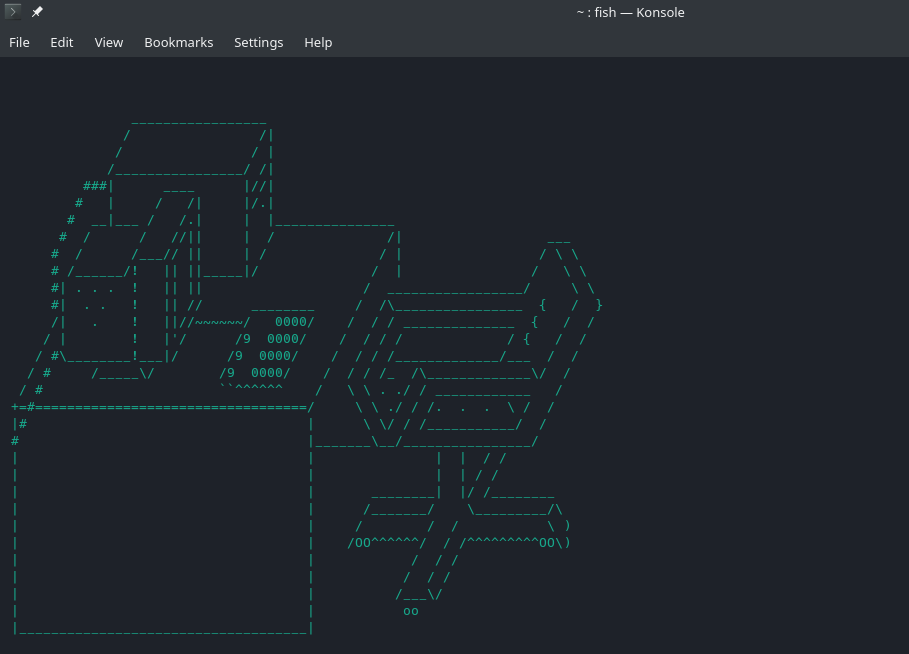

# Fish ASCII Art Splash Screen
THIS ONLY WORKS WITH THE FISH SHELL!

Automatically presents ASCII art when you open a new Fish instance. 
The reason this exists is because... why run python when you can just run a shell script?

## How to install

Just copy paste ascii_fish.fish into your config.fish and boom itll load

## Adding your own art

Make a pull request, ill probably approve it unless its retarded. Make sure to add a number to the max in the fish file.

Originally created by Dan Richards 2017.  
Ported to Fish Orion 2020.
